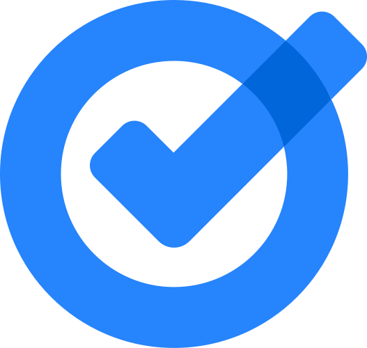
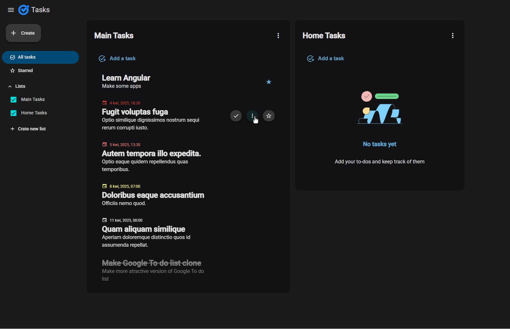

# To-Do List App 

This is a simple and intuitive to-do list application that helps users manage their daily tasks efficiently. It is a clone of Google To-Do List with some changes, allowing users to create task lists, add tasks with descriptions and deadlines, mark important tasks, and track their progress.

## Technologies Used 🛠️

-  - For building the frontend of the application
-  - To ensure a structured and type-safe codebase
-  - For deploying the application and making it accessible online
-  - For styling the UI and enhancing the design
-  - To manage reactive data streams efficiently

## Main Features ✨

- **Component-Based Structure** - Modular approach with separate components for navigation, task lists, and dialogs
- **Services for Business Logic** - Implemented services to handle dialog interactions and task management
- **Models for Data Handling** - Created models to manage task and list data effectively
- **Custom Directives** - Added a directive to enhance user interactions with tasks
- **Util Functions** - Created utility functions for time calculations and generating random IDs
- **Dark Mode UI** 🌙 - Designed a modern dark-themed interface for a better user experience

This project is built to be scalable, easy to use, and visually appealing. Contributions and suggestions are always welcome! 💡

This is my first Angular app so be honest! 😃

## Deployed App 🌐

You can view the app here 👉 [tasks-google-clone.netlify.app](https://tasks-google-clone.netlify.app/)
